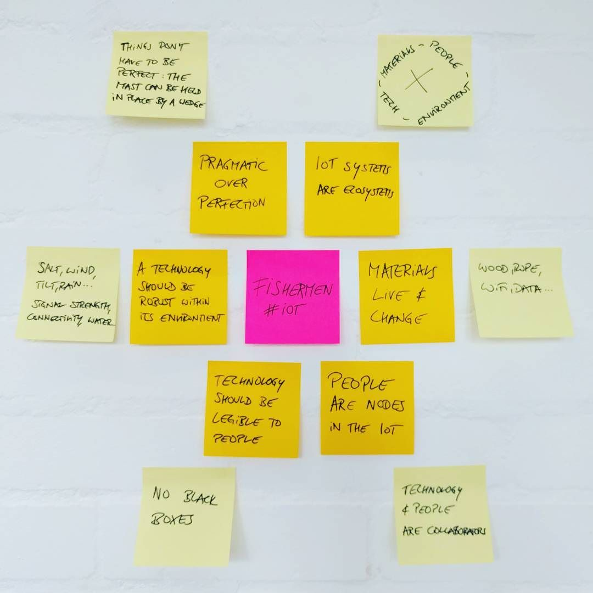

# Fishermans IoT

### We looked at traditional fishing boats and what we can learn from them.

*By Leonardo, Holly, and Peter*

## Meet the Reaper

The boat we visited and examined it the Reaper. Reaper is a Fifie Sailing Herring Drifter, the most popular design of fishing boat on the East Coast of Scotland for the greater part of the 19th and early 20th Centuries. Built in 1902 she began life as a two masted sailing lugger. She had an engine installed for the first time in 1916. In the late 1930's she held the record catch of herring in Shetland, some 223 crans - almost a quarter of a million fish.
Source: Scottish Fishery Museum (http://www.scotfishmuseum.org/reaper)

## What Internet of Things can learn from fishermen

We were brought to the “edge of the world” not because it was beautiful, unspoiled, or quaint, but to work with and learn from local communities. We found a community that was very special in that it was both savvy and conservative in its adoption of technology: the men of the Fishery Museum’s boatyard, who preserve, maintain, repair and revive a number of historic fishing boats—primarily the Reaper.

This group is special in that it both cares deeply about technology, practices, and history, and does so in a way that focuses on a very specific time. This is a snapshot of technology in the 1920s, as sailing boats were transitioning from sails to engines: a boat like the Reaper would be built with the straightforward methods and technology of a sailboat, and enhanced by a powerful engine. Digital technology was not part of the picture.

Examining the boats and speaking to these experts on historical fishing vessels we found that the way these fishermen—the crew of the Reaper was comprised of 8 men and 1 boy— interacted with technology, their expectations, skills, as well as the way the boat was built in the first place, has a lot to offer for contemporary IoT practices.

A Scottish Fisherman’s vessel from the turn of the century was built for extreme conditions. The boat had to be a self-sustaining unit that could weather critical conditions. It had to make wise use of scarce resources. The crew had to be able to maintain and fix the boat, as well as improvise solutions to unexpected challenges.

A vessel like the Reaper betrays the practices and insights of hundreds of years of experience. It is, in tech parlance, a mature and self-contained ecosystem—one that has to work with a large degree of autonomy, be self-reliant, and adaptable, no matter what conditions it operated in.

These constraints can provide valuable guidance for the way we can design, and think about, IoT systems, products, and services. For contexts of no/low connectivity, the parallels between a boat and those IoT systems are obvious. However, we believe that even in contexts that allow for more reliable connectivity there is much to be gained from operating more like a boat: with a larger degree of autonomy, self-reliantly, adaptable, and built to work in less-than-perfect conditions.

## 1. IoT systems, like boats, are ecosystems

The vessel is operated by a finely tuned and responsive ecosystem. The boat is an ecology of the relationships among several notable nodes. It is where people, materials, technologies, and the environment converge and work together. 

This ecosystem responds constantly to its environment: weather conditions will determine how the boat is powered (engine vs. sail), and how people work together to operate that technology.

The same should happen in a networked space (a home, a village, a city), where all nodes are equally important and each has its role. IoT is more than the Internet in Things. It is an ecosystem comprised of all the nodes that play a part.

## 2. Materials live and change

The wood that a boat is made of is never static, it changes shape and size based on how much water it has absorbed, and the content of salt in that water. It is constantly in flux. A fisherman and a boat maker respond to these changes in their materials to keep the boat seaworthy. 

The ship consists of materials, and those materials are living and responsive. They respond to the different nodes of the ecosystem. 

The materials of an IoT are also not static. The IoT also consists of familiar physical materials beyond chips and screens but we should also ask: what are the basic materials of our digital world, and how might we work with their characteristics and fluidity? For example, signal can be weak or strong depending on elements the radio waves encounter; algorithms depend on their interactions with input from human and non-human sources, including that of other algorithms. 

## 3. People are nodes in the IoT 

A fishing vessel is a complex technology that requires several sailors to operate. To ensure that the vessel can run smoothly, every crew member needs to be able to cover all the basics and to work together in synergy. The Reaper required 8 men and a boy to operate. The line of vision from the helm to the front of the boat is obstructed by masts and equipment. Navigating alone required one man at the steering wheel, and another upfront to serve as the eyes of the captain. 

In the boat people worked collaboratively with technologies to perform the tasks needed. Humans were also nodes of the vessel’s ecosystem. 

IoT technologies should not replace people, but instead integrate and support them. 

## 4. Technology should be legible to people 

A vessel was not stocked with many tools, but the tools that were there were those that could be utilized for many purposes. It was apparent how these tools could be used: rope could be used to hoist a sail, bind a broken rudder in an emergency, and when it was weak, be re-woven as a buoy to protect the side of the boat from scratches.  

Technologies on a boat are highly legible and hence easy to understand, modify, and work with. Many technologies on a boat didn’t live a single life: Their simple technical construction made their use apparent, and made it also possible to repair or re-appropriate to address new uses when they arose. 

Nodes in IoT should not be black boxes. They should be legible to the general user. Low-tech can be the best tech if it is open open in such a way that people not only can understand how to use it, but also how it could be used, repaired, or re-appropriated. This is empowering. 

People and technologies are part of the same network and they cannot prescind from each other. 

## 5. A technology should be robust within its environment 

Fishermen make use of several modes of navigation. There are those that are observable to the naked eye such as landmarks and other orientational technologies such as compasses, maps, and stars. When visual cues can not be of service, such as in a fog, audial cues come from a fog horn. Later sonar, radar, and GPS joined the menu of tools available. Each of these tools are resistant to the natural elements that the fisherman faces: rain, sea water, changes in incline, and wind. Also, none of these technologies retired the others—they complement each other and serve as mutual failsafes. 

The fishermen’s technologies are robust because they are resilient in their environments. They promote redundancies and failsafes.

IoT should be built with critical conditions in mind, offering alternative opportunities and avenues for the same needs to be met. It should rely on perfect connectivity as little as possible.

## 6. Pragmatism over perfection 

The Herring Drifter the Reaper was originally designed to hold a massive mast that stands more than 56 feet tall. For the first 14 years of the boat’s life, the boat was exclusively powered by sail. Despite the fact that this sail was a part of the original design, the mast does not perfectly fit into place on the boat as the materials live and change. Instead, there is a plank of wood wedged in next to this mass that’s approximately 6 feet tall extending from the deck to the cabin below to hold the mast in place.  

Things don’t have to be perfect. Instead of aiming for what is theoretically ideal, the practices that prevail are those that are effective and realistic. These are systems where parts can be adopted and incorporated into other parts, and make sense in their own environment. 

IoT should be built to evolve, and in a way that can support emergent qualities. Expect for the system to grow and adapt within itself, and to be adapted and modified by its users. 
